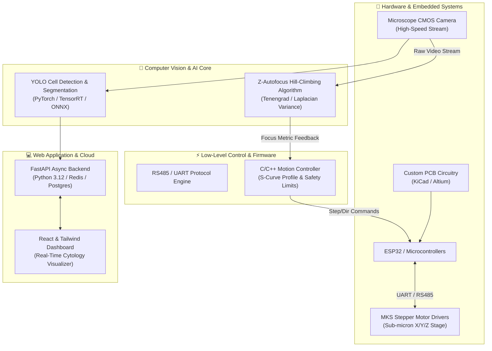
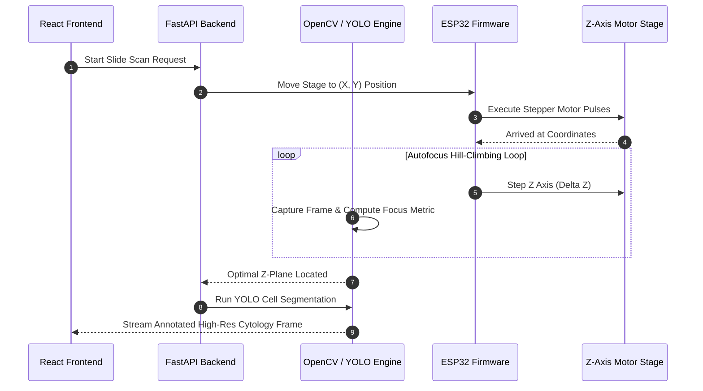
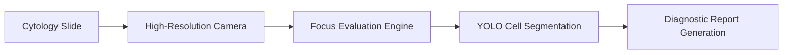

# Hi, I'm Mouhamed Boughrara 👋 

---

### 🧬 System Architecture: Hardware-Software Co-Design

---

### 📈 GitHub Activity Graph & Analytics

 

 

---

### 🔄 Control Loop: Real-Time Autofocus & Vision Pipeline

---

### 🛠️ Tech Stack & Ecosystem

| Category | Technologies & Tools |
| :--- | :--- |
| **Languages** |       |
| **Embedded & Microcontrollers** |      |
| **PCB Design & CAD** |     |
| **AI, Computer Vision & Sim** |      |
| **Backend & Cloud** |     |

---

### ⏱️ Automated WakaTime Stats

<!--START_SECTION:waka-->
<!--END_SECTION:waka-->

---

### 🌟 Featured Projects

<b>🔬 SmartCytoScan / QVision System (Click to expand)</b>

 

AI-Powered Automated Cytology Microscope & Scanner. Integrates high-precision stepper stage motion control, sub-micron Z-autofocus hill-climbing, ESP32 hardware interfaces, real-time slide cell detection using YOLO, and asynchronous FastAPI backend.

<b>⚡ High-Precision RS485 Motor Controller Firmware (Click to expand)</b>

 

Embedded C++ and Python communication stack for MKS/TMC motor drivers, implementing fast S-curve velocity profiling, limit switch safety bounds, and emergency stopping mechanisms over RS485/UART protocols.

---

**[github.com/medboughrara](https://github.com/medboughrara)** • *Hardware-Software Co-Design & Robotics AI*

