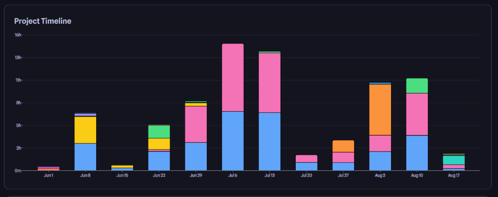

# Hi, I'm Mouhamed Boughrara 👋

---

### 🚀 About Me

I specialize in **hardware-software co-design**, bridging the gap between embedded electronics and intelligent software systems. My work centers on high-precision embedded hardware, printed circuit board (**PCB**) design, control loops, and applying **computer vision** to medical robotics and automation.

- 🔭 **Current Focus:** Leading technical development at **Qomics Startup**, building **SmartCytoScan / QVision**—an AI-driven automated cytology microscope system.
- ⚡ **Core Strengths:** Sub-micron precision motor control, real-time image processing pipelines, microcontrollers, and hardware acceleration.
- 🌱 **Learning & Researching:** Edge AI acceleration (TensorRT/ONNX), Isaac Sim robotics integration, and advanced PCB multi-layer layout optimization.
- 💬 **Ask me about:** ESP32/STM32 firmware, PCB design (KiCad/Altium), YOLO computer vision models, RS485/UART protocols, and Python/C++ integration.

---

### 📊 Interactive Project Timeline & Weekly Breakdown

 

<b>🗓️ Jul 13 - Jul 19 Breakdown (Total: 14h 39m) — <i>Click to expand / collapse</i></b>

| Project | Time Spent | Visual Ratio | Focus Area |
| :--- | :--- | :--- | :--- |
| 💗 **smart_scan** | **7h 21m** | `████████████████████` (50%) | Autofocus Hill-Climbing & Motor Calibration |
| 🔵 **SmartCytoScan** | **7h 07m** | `███████████████████░` (48%) | Cytology AI & FastAPI Architecture |
| 🟢 **micro_gpu** | **11m** | `█░░░░░░░░░░░░░░░░░░░` (2%) | Edge AI GPU Benchmarks |

<b>🗓️ Aug 10 - Aug 16 Breakdown (Total: 11h 25m) — <i>Click to expand / collapse</i></b>

| Project | Time Spent | Visual Ratio | Focus Area |
| :--- | :--- | :--- | :--- |
| 💗 **smart_scan** | **5h 30m** | `████████████████████` (48%) | Motor Pulse Engine & Safety Bounds |
| 🔵 **SmartCytoScan** | **3h 40m** | `█████████████░░░░░░░` (32%) | Real-Time Cell Segmentation Pipeline |
| 🟢 **micro_gpu** | **2h 15m** | `████████░░░░░░░░░░░░` (20%) | TensorRT & ONNX Optimization |

<b>🗓️ Aug 3 - Aug 9 Breakdown (Total: 10h 30m) — <i>Click to expand / collapse</i></b>

| Project | Time Spent | Visual Ratio | Focus Area |
| :--- | :--- | :--- | :--- |
| 🟠 **QVision_PCB** | **6h 45m** | `████████████████████` (64%) | Multi-Layer PCB KiCad Layout |
| 💗 **smart_scan** | **2h 10m** | `████████░░░░░░░░░░░░` (21%) | RS485 Communication Controller |
| 🔵 **SmartCytoScan** | **1h 35m** | `██████░░░░░░░░░░░░░░` (15%) | Diagnostic Reporting Pipeline |

<b>🗓️ Jul 6 - Jul 12 Breakdown (Total: 14h 50m) — <i>Click to expand / collapse</i></b>

| Project | Time Spent | Visual Ratio | Focus Area |
| :--- | :--- | :--- | :--- |
| 💗 **smart_scan** | **8h 00m** | `████████████████████` (54%) | Stepper Motion Acceleration |
| 🔵 **SmartCytoScan** | **6h 50m** | `█████████████████░░░` (46%) | Microscopy UI Integration |

<b>🗓️ Jun 29 - Jul 5 Breakdown (Total: 8h 10m) — <i>Click to expand / collapse</i></b>

| Project | Time Spent | Visual Ratio | Focus Area |
| :--- | :--- | :--- | :--- |
| 💗 **smart_scan** | **4h 50m** | `████████████████████` (59%) | Focus Evaluation Metric Tuning |
| 🔵 **SmartCytoScan** | **2h 45m** | `███████████░░░░░░░░░` (34%) | Database Schema & Auth Setup |
| 🟢 **micro_gpu** | **35m** | `██░░░░░░░░░░░░░░░░░░` (7%) | System Environment Profiling |

---

### ⏱️ Automated WakaTime / Hackatime Time Tracking

<!--START_SECTION:waka-->
<!--END_SECTION:waka-->

---

### 🛠️ Tech Stack & Ecosystem

| Category | Technologies & Tools |
| :--- | :--- |
| **Languages** |       |
| **Embedded & Microcontrollers** |      |
| **PCB Design & CAD** |     |
| **AI, Computer Vision & Sim** |      |
| **Backend & Cloud** |     |

---

### 🌟 Featured Projects

- 🔬 **[SmartCytoScan / QVision System](https://github.com/medboughrara)**
  *AI-Powered Automated Cytology Microscope & Scanner*
  Integrates high-precision stepper stage motion control (sub-micron Z-autofocus hill-climbing), ESP32 hardware interfaces, real-time slide cell detection using YOLO, and asynchronous FastAPI/React infrastructure.

- ⚡ **High-Precision Motor Driver & Firmware Controller**
  *Custom RS485/UART Motion Control Engine*
  Embedded C++ and Python communication stack for MKS/TMC motor drivers, implementing fast S-curve velocity profiling, limit switch safety bounds, and emergency stopping mechanisms.

- 🤖 **Microscopy Computer Vision Pipeline**
  *Deep Learning Cell Segmentation & Auto-exposure*
  Computer vision pipeline for automated slide tissue detection, focus metric evaluation (Laplacian / Tenengrad variance), and background illumination correction.

---

*Designed & Built by **Mouhamed Boughrara** • Powered by GitHub Actions, WakaTime & Hackatime*

